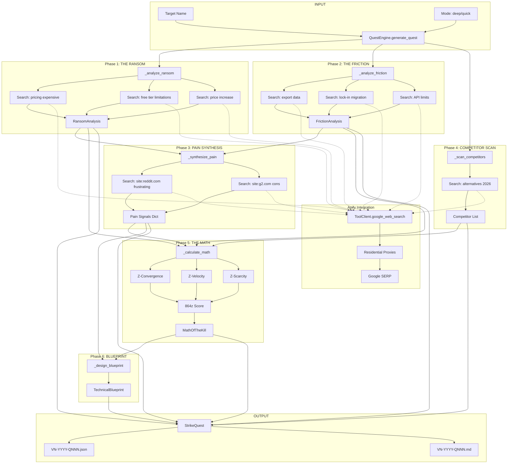

# VULTURE NEST: TECHNICAL SPECIFICATION

**Classification:** 864zeros Engineering
**Version:** 1.0.0
**Last Updated:** 2026-03-19
**Source:** `quest_engine.py`

---

## ARCHITECTURE OVERVIEW

The Quest Engine is a **standalone Python CLI** that orchestrates web research through external scraper actors, processes sentiment data, and generates structured Strike Quest documents.

### System Boundaries

```
┌─────────────────────────────────────────────────────────────────┐
│                        VULTURE NEST                             │
│                     (Research Division)                         │
├─────────────────────────────────────────────────────────────────┤
│  quest_engine.py          │  tool_wrapper.py                   │
│  - Orchestration          │  - Apify Integration               │
│  - Math Calculations      │  - Google Search Actor             │
│  - Output Generation      │  - Rate Limiting                   │
└─────────────────────────────────────────────────────────────────┘
                              │
                              ▼
┌─────────────────────────────────────────────────────────────────┐
│                      EXTERNAL SERVICES                          │
├─────────────────────────────────────────────────────────────────┤
│  Apify Platform                                                 │
│  - apify/google-search-scraper                                  │
│  - Residential Proxies                                          │
│  - Browser Fingerprinting                                       │
└─────────────────────────────────────────────────────────────────┘
```

---

## DATA FLOW DIAGRAM



---

## MODULE STRUCTURE

### quest_engine.py

| Component | Lines | Purpose |
|-----------|-------|---------|
| **Constants** | 33-58 | Scoring thresholds, T-shirt sizes, weights |
| **RansomAnalysis** | 61-75 | Dataclass for pricing pain |
| **FrictionAnalysis** | 77-91 | Dataclass for lock-in mechanisms |
| **MathOfTheKill** | 93-130 | Dataclass for financial validation |
| **TechnicalBlueprint** | 132-156 | Dataclass for architecture |
| **StrikeQuest** | 158-461 | Complete quest with JSON/Markdown output |
| **QuestEngine** | 463-1113 | Main orchestrator class |
| **CLI** | 1115-1183 | Argparse entry point |

---

## CORE CONSTANTS

```python
# The Sacred Numbers
TARGET_EXIT_VALUATION = 141312  # $141,312 target acquisition price
RULE_OF_40_THRESHOLD = 40       # Growth% + Margin% minimum
SCARCITY_THRESHOLD = 3          # Max competitors before red flag
SCORE_THRESHOLD = 8.64          # The gatekeeper threshold
LAMENT_THRESHOLD = 7            # Minimum pain intensity

# Z-Factor Weights
WEIGHTS = {
    "z_convergence": 0.45,  # Signal strength across sources
    "z_velocity": 0.35,     # Speed/recency of pain signals
    "z_scarcity": 0.20      # Lack of modern solutions
}

# T-Shirt Sizing
TSHIRT_SIZES = {
    "XS": {"hours": 24,  "description": "Single-script / Automation",     "max_complexity": 2},
    "S":  {"hours": 96,  "description": "Basic UI + API logic",           "max_complexity": 4},
    "M":  {"hours": 336, "description": "Frontend + Database + Auth",     "max_complexity": 7},
    "L":  {"hours": 720, "description": "Multi-platform / Agentic AI",    "max_complexity": 10}
}
```

---

## SCORING ALGORITHMS

### Z-Convergence Calculation

```python
def calculate_z_convergence(signals: Dict) -> float:
    """
    Measures signal density across independent sources.

    Scoring Logic:
    - Total signals ≥20: +1.5 | ≥10: +1.0 | ≥5: +0.5
    - Critical signals ≥5: +1.5 | ≥3: +1.0 | ≥1: +0.5
    - Source diversity ≥4: +1.0 | ≥2: +0.5
    - Severity bonus (ransom/friction ≥8): +1.0

    Returns: 0.0 to 1.0 (normalized)
    """
```

### Z-Velocity Calculation

```python
def calculate_z_velocity(stagnation_months: int, signal_count: int) -> float:
    """
    Measures urgency and recency of pain.

    Formula:
    - stagnation_score = min(stagnation_months / 36, 1.0)
    - signal_boost = min(signal_count / 30, 0.5)
    - velocity = (stagnation_score × 0.6) + (signal_boost × 0.4)

    Returns: 0.0 to 1.0 (normalized)
    """
```

### Z-Scarcity Calculation

```python
def calculate_z_scarcity(competitor_count: int) -> float:
    """
    Measures market gap opportunity.

    Scoring:
    - 0 competitors: 1.0 (blue ocean)
    - 1 competitor:  0.8
    - 2 competitors: 0.6
    - 3 competitors: 0.4
    - 4+ competitors: 0.1 (red ocean)

    Returns: 0.1 to 1.0
    """
```

### 864z Final Score

```python
def calculate_864z_score(z_conv, z_vel, z_scar, rule_of_40) -> tuple:
    """
    The gatekeeper calculation.

    Formula:
    1. exit_mult = 1.5 if rule_of_40 >= 40 else 1.0
    2. base_score = (z_conv × 0.45 + z_vel × 0.35 + z_scar × 0.20) × 10
    3. final_score = base_score × exit_mult

    Returns: (vulture_score, exit_multiplier)

    Threshold: 8.64
    """
```

---

## APIFY INTEGRATION

### ToolClient Interface

The engine uses `tool_wrapper.ToolClient` for web searches:

```python
from tool_wrapper import ToolClient

tool_client = ToolClient()
result = tool_client.google_web_search(query, max_results=5)
output = result.get("output", "")
```

### Search Query Templates

| Phase | Query Pattern |
|-------|---------------|
| Ransom (Pricing) | `"{target}" pricing expensive OR overpriced` |
| Ransom (Free Tier) | `"{target}" free tier limitations` |
| Ransom (Increases) | `"{target}" price increase` |
| Friction (Export) | `"{target}" export data OR "how to export"` |
| Friction (Lock-in) | `"{target}" lock-in OR migration` |
| Friction (API) | `"{target}" API limits OR restrictions` |
| Pain (Reddit) | `site:reddit.com "{target}" frustrating OR broken OR slow` |
| Pain (G2) | `site:g2.com "{target}" cons OR negative` |
| Competitors | `"{target}" alternatives 2026 OR "better than {target}"` |

### Stealth & Reliability

The Apify integration provides:

| Feature | Implementation |
|---------|----------------|
| **Residential Proxies** | Apify's rotating proxy pool |
| **Browser Fingerprinting** | Full Chrome browser emulation |
| **Rate Limiting** | Actor-level throttling (no explicit pauses in quest_engine) |
| **Retry Logic** | Handled by Apify actor internally |
| **CAPTCHA Handling** | Apify's built-in CAPTCHA solving |

**Note:** The quest_engine.py does not implement explicit systematic pauses. Rate limiting is delegated to the Apify actor's internal controls.

---

## DATA SCHEMAS

### StrikeQuest JSON Schema

Based on `STRIKE_REPORT_KNAK.json` as the gold standard:

```json
{
  "quest_id": "VN-2026-Q001",
  "target_name": "Knak",
  "generated_at": "2026-03-19T11:23:33.584536",
  "mode": "deep",

  "target": {
    "category": "micro-saas",
    "traffic": 500000,
    "stagnation_months": 18,
    "primary_weakness": "...",
    "secondary_weakness": "..."
  },

  "ransom": {
    "pricing_model": "subscription",
    "price_range": "$100",
    "free_tier_exists": true,
    "free_tier_limits": ["..."],
    "price_increase_history": [],
    "enterprise_wall": true,
    "ransom_signals": [
      {"source": "web", "content": "..."}
    ],
    "ransom_severity": 10
  },

  "friction": {
    "export_formats": ["CSV"],
    "export_limitations": ["..."],
    "api_restrictions": [],
    "data_portability_score": 3,
    "lock_in_mechanisms": [],
    "migration_complexity": "difficult",
    "friction_signals": [
      {"source": "web", "content": "..."}
    ],
    "friction_severity": 7
  },

  "math": {
    "z_convergence": 0.70,
    "z_velocity": 0.50,
    "z_scarcity": 0.80,
    "vulture_score": 9.75,
    "growth_projection": 25.0,
    "margin_projection": 85.0,
    "rule_of_40": 110.0,
    "exit_multiplier": 1.5,
    "tam_estimate": 2500000,
    "sam_estimate": 750000,
    "som_estimate": 37500,
    "target_mrr": 6750.0,
    "months_to_exit": 1,
    "exit_valuation": 141312,
    "price_point": 9.0,
    "tshirt_size": "M",
    "complexity_score": 6,
    "build_hours_estimate": 336,
    "strike_qualified": true,
    "kill_rationale": "864z score 9.75 exceeds 8.64 threshold | Rule of 40 (110.0%) qualifies for 1.5x exit multiplier"
  },

  "blueprint": {
    "product_codename": "KnakRescue",
    "tagline": "The local-first Knak alternative that respects your data.",
    "architecture_type": "chrome_extension_mv3",
    "offline_first": true,
    "cloud_dependency": "none",
    "storage_strategy": "IndexedDB",
    "rescue_capabilities": ["..."],
    "delta_features": [
      {"name": "One-Click Migration", "description": "...", "priority": "P0"}
    ],
    "required_technologies": ["Chrome Extension MV3", "IndexedDB", "Service Worker"],
    "integration_points": ["Knak export format", "Chrome Storage API"],
    "primary_metric": {"name": "Successful Migrations", "description": "...", "target": "1000 in 30 days"},
    "secondary_metric": {"name": "Retention Rate", "description": "...", "target": "70%"}
  },

  "pain_signals": {
    "total": 27,
    "critical": ["..."],
    "high": ["..."],
    "medium": ["..."],
    "sources": ["g2", "web", "reddit"],
    "traffic_estimate": 500000,
    "stagnation_months": 18,
    "ransom_severity": 10,
    "friction_severity": 7
  },

  "sentiment_synthesis": "Analysis of 27 pain signals across 3 sources indicates...",

  "competitors": [
    {"name": "Knak Alternatives", "category": "direct", "threat_level": "Medium"}
  ],

  "gtm": {
    "channels": ["r/knak", "r/selfhosted", "Indie Hackers", "Hacker News (Show HN)", "Product Hunt"],
    "positioning": "The local-first Knak alternative that puts your data first..."
  }
}
```

---

## DEPENDENCY GRAPH

### Python Dependencies

| Package | Purpose | Required |
|---------|---------|----------|
| `argparse` | CLI argument parsing | Built-in |
| `json` | JSON serialization | Built-in |
| `datetime` | Timestamp generation | Built-in |
| `pathlib` | Cross-platform paths | Built-in |
| `dataclasses` | Typed data structures | Built-in |
| `typing` | Type hints | Built-in |
| `re` | Price extraction regex | Built-in |

### External Dependencies

| Component | Source | Purpose |
|-----------|--------|---------|
| `tool_wrapper.ToolClient` | Local module | Apify API integration |
| `apify/google-search-scraper` | Apify Platform | Web search execution |

### Environment Requirements

| Variable | Purpose |
|----------|---------|
| `APIFY_TOKEN` | Apify API authentication (in tool_wrapper) |

---

## FILE OUTPUTS

### Output Directory

```
OFFICE/DIV-1-VULTURE/quests/
├── .quest_counter       # Sequence number persistence
├── VN-2026-Q001.json    # Knak quest (JSON)
├── VN-2026-Q001.md      # Knak quest (Markdown)
├── VN-2026-Q002.json    # ReadFlow quest (JSON)
├── VN-2026-Q002.md      # ReadFlow quest (Markdown)
└── VN-2026-Q003.json    # PassVault quest (JSON)
    VN-2026-Q003.md      # PassVault quest (Markdown)
```

### Quest Counter Persistence

The `.quest_counter` file stores the last used sequence number:

```python
def _load_quest_counter(self) -> int:
    counter_file = self.output_dir / ".quest_counter"
    if counter_file.exists():
        return int(counter_file.read_text().strip())
    return 0

def _save_quest_counter(self):
    counter_file = self.output_dir / ".quest_counter"
    counter_file.write_text(str(self._quest_counter))
```

---

## CLI USAGE

```bash
# Generate deep quest for target
python quest_engine.py --target "Knak" --mode deep

# Generate quick quest (synthesis only)
python quest_engine.py --target "Calendly" --mode quick

# List all generated quests
python quest_engine.py --list-quests
```

### Exit Codes

| Code | Meaning |
|------|---------|
| `0` | Strike Qualified (score ≥ 8.64) |
| `1` | Below Threshold (score < 8.64) |

---

## ERROR HANDLING

The engine uses defensive error handling for search operations:

```python
try:
    result = tool_client.google_web_search(query, max_results=5)
    output = result.get("output", "")
    # Process output...
except Exception as e:
    print(f"    [Phase] Search error: {e}")
    # Continue with empty results
```

**Design Principle:** Search failures do not halt quest generation. Missing data is reflected in lower scores, not system errors.

---

## EXTENSION POINTS

### Adding New Search Sources

To add a new search source (e.g., Trustpilot):

1. Add search query in `_synthesize_pain()`:
   ```python
   result = tool_client.google_web_search(
       f'site:trustpilot.com "{target}" review',
       max_results=5
   )
   ```

2. Append source to tracking:
   ```python
   sources.append("trustpilot")
   ```

### Modifying Scoring Weights

Weights are defined in the `WEIGHTS` constant:

```python
WEIGHTS = {
    "z_convergence": 0.45,
    "z_velocity": 0.35,
    "z_scarcity": 0.20
}
```

**Warning:** Changing weights affects all future and historical score comparisons.

### Adding New T-Shirt Sizes

```python
TSHIRT_SIZES = {
    "XS": {"hours": 24,  "max_complexity": 2, ...},
    "S":  {"hours": 96,  "max_complexity": 4, ...},
    "M":  {"hours": 336, "max_complexity": 7, ...},
    "L":  {"hours": 720, "max_complexity": 10, ...},
    # Add new size:
    "XL": {"hours": 1440, "max_complexity": 15, "description": "Enterprise Platform"}
}
```

---

## TESTING

### Manual Validation

```bash
# Test with known target
python quest_engine.py --target "Knak" --mode quick

# Verify output files exist
ls OFFICE/DIV-1-VULTURE/quests/VN-*.json

# Validate JSON structure
python -c "import json; json.load(open('OFFICE/DIV-1-VULTURE/quests/VN-2026-Q001.json'))"
```

### Expected Output Structure

A valid quest must contain:
- [ ] `quest_id` matching `VN-YYYY-QNNN` format
- [ ] Non-empty `ransom.ransom_signals` or `ransom_severity = 0`
- [ ] Non-empty `friction.friction_signals` or `friction_severity = 0`
- [ ] `math.vulture_score` between 0.0 and 15.0
- [ ] `math.strike_qualified` boolean
- [ ] `blueprint.product_codename` non-empty

---

*Document Version: 1.0.0*
*Source: quest_engine.py @ commit 9968929*
*Classification: 864zeros Engineering*
